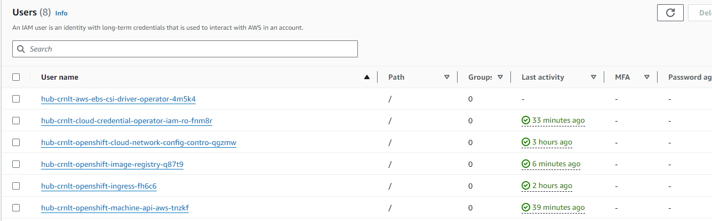

# Mint Mode

In Mint Mode OpenShift uses a User Account credentials and performs the following:
- Creates users automatically for each required openshift service
- Creates policies for the IAM Users and attaches relevant policies to the IAM Users
- Creates an Access Key and Secret Key for the IAM Users
- Creates a secret containing the Access Key and Secret Key for each service to use

On a fresh 4.12 install the following IAM Users were created


To see a list of the policies created for each service, see the directories below:  
[hub-crnlt-aws-ebs-csi-driver-operator-4m5k4](policies/hub-crnlt-aws-ebs-csi-driver-operator-4m5k4.json)  
[hub-crnlt-cloud-credential-operator-iam-ro-fnm8r](policies/hub-crnlt-cloud-credential-operator-iam-ro-fnm8r.json)  
[hub-crnlt-openshift-cloud-network-config-contro-qgzmw](policies/hub-crnlt-openshift-cloud-network-config-contro-qgzmw.json)  
[hub-crnlt-openshift-image-registry-q87t9](policies/hub-crnlt-openshift-image-registry-q87t9.json)  
[hub-crnlt-openshift-ingress-fh6c6](policies/hub-crnlt-openshift-ingress-fh6c6.json)  
[hub-crnlt-openshift-machine-api-aws-tnzkf](policies/hub-crnlt-openshift-machine-api-aws-tnzkf.json)

```shell
# The main mint user credentials are stored below
oc extract secret/aws-creds -n kube-system --to=-

# The following secrets are created by default for each service / CredentialsRequest
oc extract secrets/cloud-credential-operator-iam-ro-creds -n openshift-cloud-credential-operator --to=-
oc extract secrets/cloud-credentials -n openshift-cloud-network-config-controller --to=-
oc extract secret/image-registry-private-configuration -n openshift-image-registry --to=-
oc extract secret/cloud-credentials -n openshift-ingress-operator --to=-
oc extract secret/aws-cloud-credentials -n openshift-machine-api --to=-
```

OpenShift creates a `bootstrap` ec2 instance to create the Cluster.  
This `bootstrap` instance is created with Terraform with roles and polices attached  
After the cluster is created the bootstrap infrastructures is deleted with `terraform destroy`    
This bootstrap infra specifics are not covered here.  

OpenShift creates the cluster infra with Terraform for AWS and applies the manifests to the cluster.  
The following resource _types_ are created.  
```shell
"aws_ebs_default_kms_key", "aws_iam_instance_profile", "aws_iam_role", "aws_iam_role_policy", "aws_instance", 
"aws_lb", "aws_lb_listener", "aws_lb_target_group", "aws_lb_target_group_attachment", "aws_network_interface", 
"aws_partition", "aws_route53_record", "aws_route53_zone", "aws_security_group", "aws_security_group_rule", 
"aws_subnet", "aws_vpc",
```

For a full list check the [terraform-plan](terraform-plan.md) file  

Order of operations:

1: OpenShift Creates the Cluster AWS Resources with Terraform
2: OpenShift Creates an AWS Load Balancer and Record for the OpenShift API. OpenShift Creates master nodes (tested on singe node openshift)
3: OpenShift Creates the Bootstrap AWS Resources with Terraform
4: OpenShift creates bootstrap EC2 instance and S3 Bucket to connect to and configure the cluster
5: OpenShift adds the bootstrap.ign ignition file to the S3 Bucket
6: OpenShift creates the cluster with the bootstrap.ign file*
7: Wait until the cluster is created - ClusterOperators all have a status of `Available` and API available
8: OpenShift deletes the bootstrap infra with `terraform destroy`

The OpenShift `bootstrap.ign` file contains the _magic_ that actually creates the cluster.  
The bootstrap.ign file contains json with base64 encoded data for the cluster to use.  
This includes scripts such as bootkube.sh and the manifests for the cluster.  

<details>
<summary>Expand to show full list of files created by OpenShift Ignition</summary>

```shell
/etc/containers/registries.conf
/etc/ignition-machine-config-encapsulated.json
/etc/motd
/etc/pki/ca-trust/source/anchors/ca.crt
/etc/profile.d/proxy.sh
/etc/systemd/system.conf.d/10-default-env.conf
/root/.docker/config.json
/usr/local/bin/approve-csr.sh
/usr/local/bin/bootkube.sh
/usr/local/bin/bootstrap-cluster-gather.sh
/usr/local/bin/bootstrap-pivot.sh
/usr/local/bin/bootstrap-service-record.sh
/usr/local/bin/bootstrap-verify-api-server-urls.sh
/usr/local/bin/crio-configure.sh
/usr/local/bin/installer-gather.sh
/usr/local/bin/installer-masters-gather.sh
/usr/local/bin/kubelet-pause-image.sh
/usr/local/bin/kubelet.sh
/usr/local/bin/release-image-download.sh
/usr/local/bin/release-image.sh
/usr/local/bin/report-progress.sh
/opt/openshift/manifests/cluster-config.yaml
/opt/openshift/manifests/cluster-dns-02-config.yml
/opt/openshift/manifests/cluster-infrastructure-02-config.yml
/opt/openshift/manifests/cluster-ingress-02-config.yml
/opt/openshift/manifests/cluster-ingress-default-ingresscontroller.yaml
/opt/openshift/manifests/cluster-network-01-crd.yml
/opt/openshift/manifests/cluster-network-02-config.yml
/opt/openshift/manifests/cluster-proxy-01-config.yaml
/opt/openshift/manifests/cluster-scheduler-02-config.yml
/opt/openshift/manifests/cvo-overrides.yaml
/opt/openshift/manifests/kube-cloud-config.yaml
/opt/openshift/manifests/kube-system-configmap-root-ca.yaml
/opt/openshift/manifests/machine-config-server-tls-secret.yaml
/opt/openshift/manifests/openshift-config-secret-pull-secret.yaml
/opt/openshift/openshift/99_cloud-creds-secret.yaml
/opt/openshift/openshift/99_kubeadmin-password-secret.yaml
/opt/openshift/openshift/99_role-cloud-creds-secret-reader.yaml
/opt/openshift/openshift/openshift-install-manifests.yaml
/opt/openshift/openshift/99_openshift-cluster-api_master-user-data-secret.yaml
/opt/openshift/openshift/99_openshift-machineconfig_99-master-ssh.yaml
/opt/openshift/openshift/99_openshift-cluster-api_master-machines-0.yaml
/opt/openshift/openshift/99_openshift-cluster-api_worker-user-data-secret.yaml
/opt/openshift/openshift/99_openshift-machineconfig_99-worker-ssh.yaml
/opt/openshift/openshift/99_openshift-cluster-api_worker-machineset-0.yaml
/opt/openshift/original_cvo_overrides.patch
/opt/openshift/auth/kubeconfig
/opt/openshift/auth/kubeconfig-kubelet
/opt/openshift/auth/kubeconfig-loopback
/opt/openshift/tls/admin-kubeconfig-ca-bundle.crt
/opt/openshift/tls/aggregator-ca.key
/opt/openshift/tls/aggregator-ca.crt
/opt/openshift/tls/aggregator-ca-bundle.crt
/opt/openshift/tls/aggregator-client.key
/opt/openshift/tls/aggregator-client.crt
/opt/openshift/tls/aggregator-signer.key
/opt/openshift/tls/aggregator-signer.crt
/opt/openshift/tls/apiserver-proxy.key
/opt/openshift/tls/apiserver-proxy.crt
/opt/openshift/tls/kube-apiserver-lb-ca-bundle.crt
/opt/openshift/tls/kube-apiserver-lb-server.key
/opt/openshift/tls/kube-apiserver-lb-server.crt
/opt/openshift/tls/kube-apiserver-internal-lb-server.key
/opt/openshift/tls/kube-apiserver-internal-lb-server.crt
/opt/openshift/tls/kube-apiserver-lb-signer.key
/opt/openshift/tls/kube-apiserver-lb-signer.crt
/opt/openshift/tls/kube-apiserver-localhost-ca-bundle.crt
/opt/openshift/tls/kube-apiserver-localhost-server.key
/opt/openshift/tls/kube-apiserver-localhost-server.crt
/opt/openshift/tls/kube-apiserver-localhost-signer.key
/opt/openshift/tls/kube-apiserver-localhost-signer.crt
/opt/openshift/tls/kube-apiserver-service-network-ca-bundle.crt
/opt/openshift/tls/kube-apiserver-service-network-server.key
/opt/openshift/tls/kube-apiserver-service-network-server.crt
/opt/openshift/tls/kube-apiserver-service-network-signer.key
/opt/openshift/tls/kube-apiserver-service-network-signer.crt
/opt/openshift/tls/kube-apiserver-complete-server-ca-bundle.crt
/opt/openshift/tls/kube-apiserver-complete-client-ca-bundle.crt
/opt/openshift/tls/kube-apiserver-to-kubelet-ca-bundle.crt
/opt/openshift/tls/kube-apiserver-to-kubelet-client.key
/opt/openshift/tls/kube-apiserver-to-kubelet-client.crt
/opt/openshift/tls/kube-apiserver-to-kubelet-signer.key
/opt/openshift/tls/kube-apiserver-to-kubelet-signer.crt
/opt/openshift/tls/kube-control-plane-ca-bundle.crt
/opt/openshift/tls/kube-control-plane-kube-controller-manager-client.key
/opt/openshift/tls/kube-control-plane-kube-controller-manager-client.crt
/opt/openshift/tls/kube-control-plane-kube-scheduler-client.key
/opt/openshift/tls/kube-control-plane-kube-scheduler-client.crt
/opt/openshift/tls/kube-control-plane-signer.key
/opt/openshift/tls/kube-control-plane-signer.crt
/opt/openshift/tls/kubelet-bootstrap-kubeconfig-ca-bundle.crt
/opt/openshift/tls/kubelet-client-ca-bundle.crt
/opt/openshift/tls/kubelet-client.key
/opt/openshift/tls/kubelet-client.crt
/opt/openshift/tls/kubelet-signer.key
/opt/openshift/tls/kubelet-signer.crt
/opt/openshift/tls/kubelet-serving-ca-bundle.crt
/opt/openshift/tls/machine-config-server.key
/opt/openshift/tls/machine-config-server.crt
/opt/openshift/tls/service-account.key
/opt/openshift/tls/service-account.pub
/opt/openshift/tls/journal-gatewayd.key
/opt/openshift/tls/journal-gatewayd.crt
/opt/openshift/tls/root-ca.crt
```
</details>

Users can generate and explore the `bootstrap.ign` file or the generated manifests with the following commands:   
```shell
# Generation requires a install-config.yaml file
openshift-install create ignition-configs --dir=./
openshift-install create manifests --dir=./
```

https://docs.redhat.com/zh_hans/documentation/openshift_container_platform/4.5/html/architecture/ignition-config-viewing_architecture-rhcos  